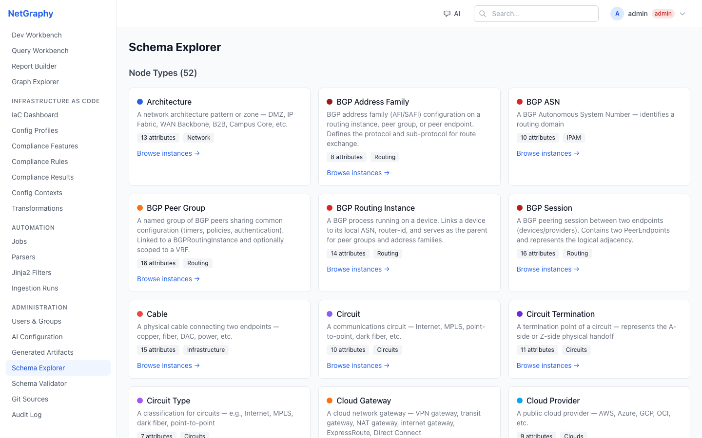
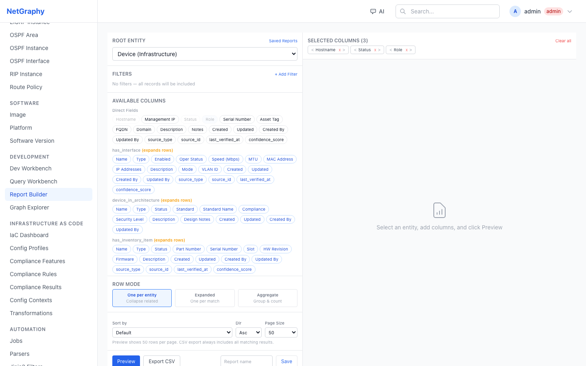
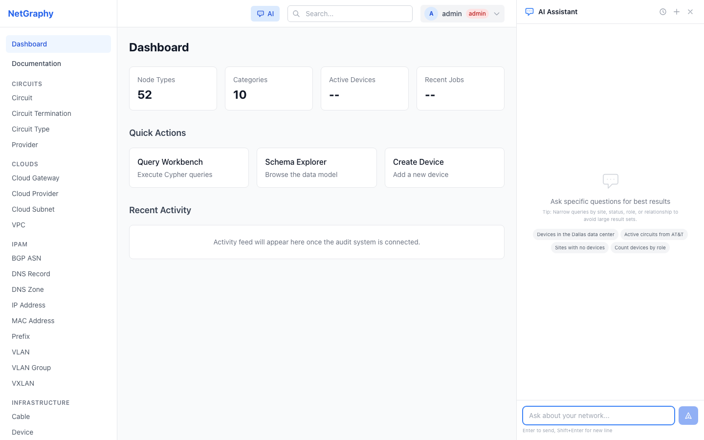
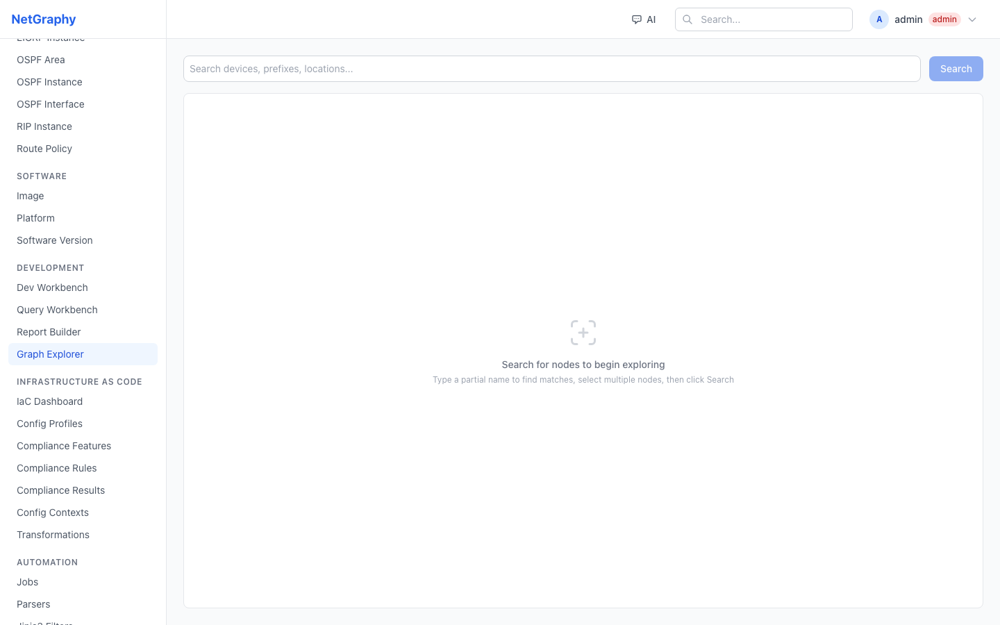

<p align="center">
  <h1 align="center">NetGraphy</h1>
  <p align="center"><strong>The network is a graph. Your source of truth should be too.</strong></p>
  <p align="center">
    Graph-native network source of truth. Schema-driven. AI-native. Topology-first.
  </p>
</p>

<p align="center">
  <a href="#getting-started">Getting Started</a> &middot;
  <a href="#why-netgraphy-exists">Why NetGraphy</a> &middot;
  <a href="#feature-comparison">Feature Comparison</a> &middot;
  <a href="#early-adopters">Early Adopters</a> &middot;
  <a href="#contributing">Contributing</a>
</p>

---

## What NetGraphy Is

NetGraphy is a **graph-native network source of truth** built for how networks actually work: as interconnected systems of relationships, not rows in a table.

It is a **schema-driven platform** where your entire data model, API surface, filtering system, reporting engine, AI capabilities, and UI are generated from YAML definitions. You extend the platform by writing schema, not by building applications.

NetGraphy is **not another CRUD inventory tool**. It is:

- A **topology-native** inventory system where relationships between devices, interfaces, circuits, locations, and services are first-class data, not afterthoughts
- An **AI-native** platform where agents reason over your actual network graph using schema-generated tools with real authorization enforcement
- A **reporting platform** where you can filter and export across nodes, edges, and multi-hop relationships in a single query
- An **extensible framework** where adding a new data model is a YAML file, not a development project



---

## Why NetGraphy Exists

Networks are graphs. Devices connect to interfaces. Interfaces carry circuits. Circuits traverse locations. Locations belong to regions. VLANs span sites. BGP sessions peer across autonomous systems. Every operational question is a graph traversal.

But the tools we use to manage this data treat it as a collection of independent tables.

**The problems this creates are real:**

- **Topology is reconstructed after the fact.** You model devices and interfaces separately, then try to infer or manually build the topology. The source of truth doesn't natively represent how things connect.

- **Relationship-heavy queries are painful.** "Show me all devices at sites in Texas with active circuits from AT&T" requires joining across multiple models, often with custom code or complex API chaining.

- **Reporting across models is limited.** You can report on devices or on circuits, but reporting across devices + their interfaces + their locations + their circuits in a single exportable view requires workarounds.

- **Extending the data model requires development.** Need to track a new type of object or relationship? In most platforms, that means building a plugin, writing migrations, creating API endpoints, and building UI forms. In NetGraphy, it means writing a YAML file.

- **AI is bolted on, not built in.** Chat interfaces exist, but they operate on top of the platform rather than inside it. They can't traverse relationships, respect permissions, or use schema-aware tools.

- **Diagrams exist because the source of truth lacks native topology.** If your source of truth natively represented topology, you wouldn't need Visio to understand your network.

NetGraphy exists to build the source of truth that network infrastructure actually needs.

---

## Core Value Drivers

### Graph-Native Source of Truth

Relationships are first-class data in NetGraphy. They are not foreign keys. They are not inferred. They are explicit, typed, directional, and can carry their own attributes.

When you create a device and place it at a location, that `LOCATED_IN` relationship is a real edge in the graph with its own properties (rack position, rack face). When you connect an interface to a circuit termination, that connection exists as traversable graph data.

This means:
- Topology queries are direct graph traversals, not multi-table joins
- "What is connected to what" is a native operation, not a reconstruction
- Path analysis, impact assessment, and dependency mapping use the actual data model

### Schema-Driven Extensibility

This is the key architectural difference between NetGraphy and traditional platforms.

**NetBox and Nautobot** support extensibility through custom fields and through plugin/app development. Custom fields work well for adding attributes to existing models. Deeper extensions — new object types, new relationships, new validation rules, new API behaviors — require building a plugin or app, which means Python development, database migrations, and maintenance.

**NetGraphy** extends entirely through schema definitions:

```yaml
kind: NodeType
version: v1
metadata:
  name: WirelessController
  display_name: Wireless Controller
  category: Infrastructure
attributes:
  hostname:
    type: string
    required: true
    indexed: true
  ap_count:
    type: integer
  firmware:
    type: string
```

That YAML file automatically generates:
- REST API endpoints (CRUD + filtering + pagination)
- MCP tools for AI agent interaction
- UI list view, detail view, and form
- Validation rules
- Report builder columns and filter paths
- Graph explorer node type
- Documentation pages

**Extend your data model without building an app first.**


### Relationship-Native Filtering and Reporting

NetGraphy's report builder and query engine understand relationships natively. You can:

- Filter devices by their **location's city**: `located_in.Location.city contains "Dallas"`
- Filter circuits by their **provider's name**: `circuit_from_provider.Provider.name contains "AT&T"`
- Filter devices by the **status of their interfaces**: `has_interface.Interface.oper_status eq "up"`
- Find **sites with no devices**: relationship existence filter
- Count **devices grouped by role at each location**: aggregate report

Reports can include columns from the root object, related objects, and edge attributes. When a one-to-many relationship is included (e.g., Device + Interfaces), the report engine automatically expands rows for CSV-safe export — one row per device-interface pair, not collapsed arrays.



### AI-Native Platform

NetGraphy doesn't bolt AI onto the side. The AI agent is built into the platform architecture:

- **Schema-generated tools**: Every node type and relationship in your schema produces MCP tools the agent can call. The tools support structured filters, relationship traversal, pagination, and aggregation.
- **Authorization-aware**: The agent inherits the acting user's permissions. It cannot see data the user cannot see. Destructive actions require confirmation.
- **Graph-aware reasoning**: The agent is instructed to use explicit relationship queries, not hostname pattern matching. "Devices in Dallas" resolves through the `LOCATED_IN` relationship, not by matching `DAL-` prefixes.
- **Multi-provider support**: Anthropic Claude, OpenAI, Google Vertex AI, AWS Bedrock, Azure, or any OpenAI-compatible endpoint (vLLM, Ollama).
- **Observable**: Built-in OpenTelemetry tracing to Phoenix, Jaeger, or any OTLP collector. Configure from the UI, not environment variables.



### Topology-Native Platform

The graph explorer is not a visualization layer added after the fact. It renders the actual graph database topology directly. You can:

- Explore device connectivity, circuit paths, location hierarchies
- Filter by node type, status, relationship type
- Traverse outward from any node
- See the same relationships the query engine and AI agent use

This eliminates the gap between "what the source of truth knows" and "what the network diagram shows."



### Discovery and Ingestion

NetGraphy includes a discovery system built on proven network automation patterns:

- **Command execution** via Nornir/Netmiko
- **Parsing** via TextFSM templates with a built-in IDE for development
- **Mapping** via Jinja2 templates that transform parsed output into graph operations
- **Provenance tracking** on all discovered data (source, timestamp, parser, job reference)

The entire pipeline is schema-driven and extensible through YAML definitions.

### Infrastructure as Code / Inventory as Code

NetBox and Nautobot support Git-integrated workflows and have strong automation ecosystems. NetGraphy is designed around the same principles but extends them:

- **Schema as code**: Data model definitions live in version-controlled YAML files
- **Inventory as code**: Network data can be managed through Git-backed workflows
- **Config compliance**: Golden config comparison with line-diff and deep-diff engines
- **Git sync**: Schema, parsers, mappings, and queries sync from Git repositories

---

## Feature Comparison

| Capability | NetGraphy | NetBox | Nautobot | Notes |
|---|---|---|---|---|
| **Graph-native data model** | Yes | No | No | Neo4j graph DB vs. PostgreSQL relational |
| **Schema extension without app development** | Yes | No | No | YAML definitions auto-generate API, UI, tools |
| **Custom fields** | Yes | Yes | Yes | All platforms support adding fields to existing models |
| **Plugin/app extensibility** | Target Design | Yes | Yes | NetBox/Nautobot have mature plugin ecosystems |
| **Relationship-native filtering** | Yes | Partial | Partial | Filter across nodes, edges, and related nodes |
| **Multi-hop graph queries** | Yes | No | No | Native graph traversal queries |
| **Relationship-aware reporting + CSV export** | Yes | Partial | Partial | Row expansion for one-to-many relationships |
| **AI-native platform** | Yes | Plugin | Plugin | Schema-generated tools, auth-aware, graph reasoning |
| **Topology graph explorer** | Yes | Partial | Partial | Direct graph DB visualization |
| **Graph query builder** | Yes | No | No | Cypher query workbench with visualization |
| **Discovery (TextFSM/Jinja2)** | Yes | Ecosystem | Yes | Nautobot has strong built-in discovery via Jobs |
| **Git/IaC workflows** | Yes | Ecosystem | Yes | All support Git integration at different levels |
| **Inventory as code vision** | Yes | Partial | Partial | Full schema + data version control |
| **Multi-provider AI** | Yes | No | No | Anthropic, OpenAI, Vertex, Bedrock, vLLM, Ollama |
| **AI observability (OTel)** | Yes | No | No | Phoenix/Jaeger integration, UI-configurable |

> **A note on honesty**: NetBox and Nautobot are mature, battle-tested platforms with large communities and extensive plugin ecosystems. NetGraphy is early-stage. This comparison reflects architectural capabilities, not production readiness. Choose the right tool for where you are today while considering where you want to be.

---

## Why This Is Different

The thesis behind NetGraphy is simple:

**Tables store records. Graphs store relationships.**

In network infrastructure, relationships drive everything:
- **Operations**: What is connected to what? What is the blast radius of this change?
- **Validation**: Does every device have a location? Does every circuit have both terminations?
- **Reporting**: Show me all devices at sites in region X with circuits from provider Y
- **AI reasoning**: The agent doesn't need to guess relationships from naming conventions — the graph knows

When your source of truth is a graph, topology is not something you reconstruct. It is the data model.

When your platform is schema-driven, extensibility is not a development project. It is a configuration change.

When AI is built into the architecture, it doesn't just answer questions about your data. It operates on your data with the same permissions, filters, and relationship awareness as the platform itself.

---

## Early Adopters

NetGraphy is looking for early adopters and design partners who want to shape the future of network source of truth.

### Who Should Try This

- **Network engineers** frustrated with the gap between what their source of truth knows and what their network looks like
- **NRE/NetDevOps teams** who want schema-driven extensibility without plugin development
- **Automation engineers** who need relationship-native queries for their workflows
- **Source-of-truth owners** evaluating next-generation platforms
- **AI + infrastructure builders** exploring how LLMs can interact with network data safely

### What to Try First

1. **Explore the graph**: Seed the demo data, open the Graph Explorer, click through device topologies
2. **Build a report**: Open the Report Builder, select Device, add columns from related Locations and Interfaces, export CSV
3. **Talk to the AI**: Open the chat panel, ask "Show me devices in Dallas" or "Count devices by role"
4. **Extend the schema**: Create a YAML file defining a new node type, restart, and see it appear everywhere automatically
5. **Run a query**: Open the Query Workbench, write a Cypher query, see results as both table and graph

### What Feedback We Need

- Does the schema-driven approach work for your data model?
- What relationship types are missing for your environment?
- Where does the AI agent succeed or fail on your questions?
- What reports do you need that the builder can't produce yet?
- What discovery/ingestion workflows matter most?

Open an issue or start a discussion. Every piece of feedback shapes the platform.

---

## Project Status

NetGraphy is **early-stage and actively developed**. Core systems are functional but evolving.

### Working Now

- Graph database backend (Neo4j) with full CRUD
- Schema engine with YAML loading, validation, and code generation
- Dynamic UI generation from schema (list views, detail views, forms)
- Query workbench with Cypher execution and graph visualization
- Report builder with relationship-native filtering and CSV export
- AI agent with multi-provider support and schema-generated tools
- Graph explorer with topology visualization
- User/group management with RBAC
- Infrastructure as Code (config compliance, golden config)
- Discovery pipeline (TextFSM parsing, Jinja2 mapping)
- Documentation system with schema-driven generation
- OpenTelemetry observability for AI interactions

### In Progress

- Production hardening of relationship query filters
- Advanced graph traversal depth controls
- Saved report sharing and scheduling
- Discovery job scheduling and monitoring
- Git sync for schema and content

---

## Getting Started

### Prerequisites

- Docker and Docker Compose
- Node.js 18+ (for frontend development)
- Python 3.11+ (for backend development)

### Quick Start

```bash
# Clone the repository
git clone https://github.com/NetGraphy/NetGraphy.git
cd NetGraphy

# Start infrastructure (Neo4j, NATS, Redis)
docker compose up -d

# Install backend dependencies
cd apps/api
pip install -e ".[dev]"

# Start the API server
uvicorn netgraphy_api.app:app --reload --port 8000

# In a new terminal — install frontend dependencies
cd apps/web
npm install

# Start the frontend dev server
npm run dev
```

### Seed Demo Data

```bash
# Set environment variables
export NETGRAPHY_URL=http://localhost:8000/api/v1
export NETGRAPHY_USER=admin
export NETGRAPHY_PASS=admin

# Run the seed script (creates ~40 devices across 14 locations with full topology)
python scripts/seed.py
```

### Default Credentials

- **Username**: `admin`
- **Password**: `admin`

### What to Explore

1. **Dashboard** — Overview of your network inventory
2. **Graph Explorer** — Visual topology exploration (`/graph`)
3. **Query Workbench** — Write and execute Cypher queries (`/query`)
4. **Report Builder** — Build filtered reports with CSV export (`/reports`)
5. **Schema Explorer** — Browse your data model (`/schema`)
6. **AI Assistant** — Click the "AI" button in the top bar
7. **Documentation** — Auto-generated from schema (`/docs`)

---

## Documentation

NetGraphy's documentation system is:

- **Markdown-based** — Write docs in standard Markdown
- **Source-controlled** — Lives alongside the code in Git
- **Schema-driven** — Node type docs, edge type docs, and overview pages are auto-generated from schema definitions
- **Knowledge graph** — Documentation pages are stored as graph nodes with relationship edges, enabling AI-powered retrieval
- **Platform-rendered** — Browse and edit directly in the NetGraphy UI

---

## Contributing

NetGraphy is open source and welcomes contributions at every level.

### How to Contribute

- **Report issues**: Found a bug or unexpected behavior? [Open an issue](https://github.com/NetGraphy/NetGraphy/issues)
- **Suggest features**: Have an idea for a capability? Start a discussion
- **Test and provide feedback**: Run the platform against your data model and tell us what works and what doesn't
- **Submit PRs**: Bug fixes, new schema types, documentation improvements, test coverage
- **Build schema extensions**: Create YAML definitions for new network object types and share them

### Development Setup

```bash
# Run tests
cd apps/api
pytest tests/

# Type checking
mypy packages/

# Frontend linting
cd apps/web
npm run lint
```

---

## Roadmap

Near-term priorities:

- **Relationship query hardening** — Production-grade graph filter execution
- **Schema-driven discovery** — Auto-generate discovery jobs from schema
- **Report scheduling** — Scheduled report execution with email/webhook delivery
- **Graph query templates** — Saved and parameterized Cypher queries
- **Inventory diff** — Git-based inventory comparison and drift detection
- **Multi-tenancy** — Full tenant isolation for managed service deployments
- **Plugin framework** — Schema-based plugin distribution for community extensions
- **Mobile-responsive UI** — Responsive layout for field engineering use

---

## Architecture

```
apps/
  api/          # FastAPI backend — dynamic CRUD, query engine, AI agent
  web/          # React + TypeScript frontend — schema-driven UI

packages/
  schema_engine/   # YAML schema loading, validation, code generation
  graph_db/        # Neo4j driver, Cypher builder, repositories
  query_engine/    # Query AST, compiler, report engine, CSV export
  ai/              # Agent runtime, providers, tracing, conversations
  auth/            # JWT, RBAC, groups, LDAP/SSO
  events/          # NATS event bus
  ingestion/       # Discovery pipeline

content/
  schemas/         # YAML schema definitions (the source of truth)
  parsers/         # TextFSM templates
  mappings/        # Jinja2 mapping templates

scripts/           # Seed data, utilities
infra/             # Docker, deployment configs
```

---

## License

[MIT License](LICENSE)

---

<p align="center">
  <strong>The network is a graph. Your source of truth should be too.</strong>
  <br/>
  <a href="https://github.com/NetGraphy/NetGraphy/issues">Report Issues</a> &middot;
  <a href="https://github.com/NetGraphy/NetGraphy/discussions">Discussions</a> &middot;
  <a href="#getting-started">Get Started</a>
</p>
