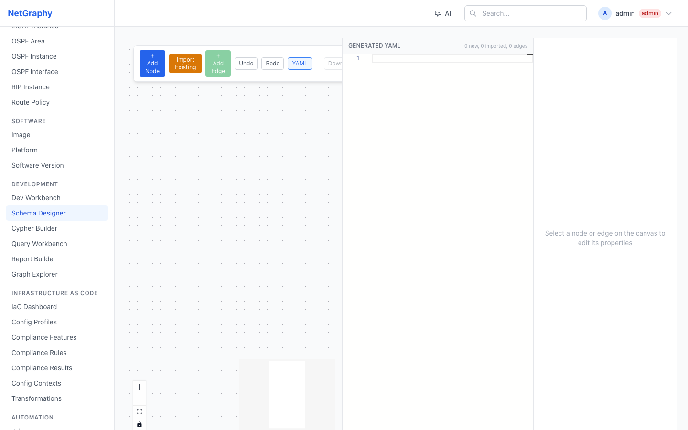

# Visual Schema Designer

The Visual Schema Designer is a browser-based tool at `/schema-designer` for creating and editing NetGraphy schema definitions through a graphical ERD (Entity-Relationship Diagram) interface. Instead of writing YAML by hand, you draw node types on a canvas, connect them with edges, configure attributes and constraints in a sidebar panel, and let the designer generate valid YAML for you.

## Architecture and Data Flow

The designer maintains three synchronized views of the same data:

1. **ERD Canvas** (React Flow) -- a visual diagram of node types and their relationships, rendered as draggable boxes and directional arrows.
2. **Property Panel** (right sidebar, 300px) -- a form-based editor for the currently selected node or edge.
3. **YAML Panel** (right panel, 400px, toggleable) -- a read-only Monaco editor displaying the live-generated YAML output.

The canonical in-memory model is a Zustand store (`schemaDesignerStore`). This store is the single source of truth. Both the canvas and the YAML panel are projections of the store state. Every mutation -- adding a node, renaming an attribute, changing cardinality -- goes through the store, and both views react to the change automatically. Every entity in the store has a stable UUID that never changes; names are editable, but internal references between nodes and edges use immutable IDs.

## Page Layout

The page fills the viewport below the navigation bar (`100vh - 64px`) and is divided into three regions arranged left to right:

- **Left / Center**: The ERD canvas occupies all remaining horizontal space. It supports pan, zoom, snap-to-grid (16px increments), and includes a minimap in the bottom-right corner and zoom/pan controls in the bottom-left.
- **Right sidebar (300px, always visible)**: The Property Panel. When nothing is selected, it displays a prompt to select a node or edge. When a node or edge is selected, it shows the full set of editable fields.
- **Right panel (400px, toggleable)**: The YAML panel. Toggled on and off via the YAML button in the toolbar. Displays the generated YAML in a Monaco editor with syntax highlighting and line numbers.

## Toolbar

The toolbar sits in the top-left corner of the canvas as a floating panel. It contains the following controls, from left to right:

**+ Add Node** (blue button): Creates a new node type from scratch. Clicking it reveals an inline text input where you enter a PascalCase name (e.g., `WirelessNetwork`). Press Enter or click Add to confirm. The new node appears on the canvas with default settings: category "Custom", color indigo (`#6366F1`), and the `lifecycle_mixin` applied automatically.

**Import Existing** (amber button): Opens a modal dialog that lists all node types currently registered in the live schema. You can search by typing (the filter matches against both the internal name and the display name). Click any node type to import it onto the canvas with all of its attributes, metadata, and color intact. Nodes already on the canvas are grayed out and disabled. Imported nodes serve as reference targets for relationships -- they are explicitly excluded from the generated YAML output.

**+ Add Edge** (green button): Opens a dialog for creating a relationship between any two nodes on the canvas. The dialog contains fields for the relationship name (e.g., `HAS_WIRELESS_NETWORK`), source node dropdown, target node dropdown, and cardinality selector. Self-referencing edges (same source and target) are supported. This button is disabled when fewer than one node exists on the canvas.

**Undo / Redo**: Two buttons that navigate the history stack. The store maintains a 50-entry history of JSON-serialized snapshots. Keyboard shortcuts are also supported: `Ctrl+Z` (or `Cmd+Z` on macOS) for undo, `Ctrl+Shift+Z` (or `Cmd+Shift+Z`) for redo.

**YAML**: Toggles the YAML panel visibility. When active, the button is highlighted with a brand-colored border.

**Download**: Exports the generated YAML as a `.yaml` file. The filename defaults to the design name if one has been set, otherwise `schema.yaml`. Disabled when no nodes exist on the canvas.

**Save / Load**: Opens a dialog with two sections. The Save section provides a name input and Save button that upserts the current design to Neo4j by name. The Load section lists previously saved designs; clicking one restores the full canvas state including node positions, attributes, edges, and imported reference tracking.

**Validation indicator**: When validation errors exist, a red error count (e.g., "3 error(s)") appears at the right edge of the toolbar. Validation runs automatically whenever the schema changes.

## Creating New Node Types

1. Click **+ Add Node** in the toolbar.
2. Type a PascalCase name in the input field that appears (e.g., `WirelessNetwork`).
3. Press Enter or click the Add button.
4. The node appears on the canvas as a box with a colored header.
5. Click the node to select it. The Property Panel on the right populates with the node's editable fields.
6. Configure the node's metadata and attributes in the Property Panel (see below).

New nodes are placed at a semi-random position on the canvas. You can drag them to any location; positions snap to a 16px grid.

## Importing Existing Node Types

1. Click **Import Existing** (amber button) in the toolbar.
2. A modal appears listing all registered node types from the live schema.
3. Type in the search box to filter (e.g., type "Device" or "Inter" to find Interface).
4. Click a node type to add it to the canvas. It appears with all of its attributes, color, category, and icon.
5. Nodes already present on the canvas are shown grayed out with an "on canvas" label and cannot be re-imported.
6. Close the modal when finished.

Imported nodes are visually identical to new nodes on the canvas, but they are tracked separately in an `importedNames` set. The key distinction: **imported nodes do not appear in the generated YAML**. They exist on the canvas solely as relationship targets so you can draw edges from your new node types to existing ones in the schema.

## Creating Relationships (Edges)

There are two ways to create edges:

### Drag-to-Connect

Every node on the canvas has two connection handles: a target handle on the left edge and a source handle on the right edge. To create a relationship:

1. Hover over the right-side handle (source dot) of the source node.
2. Click and drag to the left-side handle (target dot) of the destination node.
3. A dialog appears showing the source and target node names and prompting for a relationship name.
4. Enter the name (e.g., `HAS_INTERFACE`) and click Create.

### Add Edge Dialog

1. Click **+ Add Edge** (green button) in the toolbar.
2. Enter a relationship name (e.g., `HAS_WIRELESS_NETWORK`).
3. Select the source node from the dropdown (all canvas nodes are listed).
4. Select the target node from the dropdown. You may select the same node for a self-referencing edge.
5. Choose a cardinality: One to One (1:1), One to Many (1:N), Many to One (N:1), or Many to Many (N:N). The default is Many to Many.
6. Click Create Relationship.

The edge name is automatically converted to UPPER_SNAKE_CASE by the store (spaces replaced with underscores, all characters uppercased).

## ERD Canvas Details

### Node Rendering

Each node is displayed as a rounded box with:

- **Header**: Shows the node name in bold and a color dot matching the node's configured color. The header background uses the node color at low opacity. If a category is set, it appears below the name in small uppercase text.
- **Attribute list**: Each attribute is shown as a row with a colored dot (color varies by type -- blue for string, green for integer/float, amber for boolean, purple for enum, pink for datetime, cyan for ip_address, gray for json), the attribute name, the type label, and constraint badges:
  - Red `*` = required
  - Amber `U` = unique
  - Blue `I` = indexed
- A maximum of 8 attributes are shown. If a node has more, a "+N more" indicator appears at the bottom.

Selected nodes are highlighted with a brand-colored border and ring.

### Edge Rendering

Edges are displayed as directional arrows with:

- A label showing the display name and cardinality in parentheses (e.g., "Has Interface (1:N)")
- An arrowhead at the target end
- A light background behind the label for readability

When an edge is selected, it turns purple with a thicker stroke and an animation effect. Click any edge to select it and edit its properties in the Property Panel.

### Canvas Interactions

- **Pan**: Click and drag on the background.
- **Zoom**: Scroll wheel or use the controls in the bottom-left.
- **Select a node**: Click on it. The Property Panel updates.
- **Select an edge**: Click on the edge line or label. The Property Panel updates.
- **Deselect**: Click on the canvas background.
- **Move a node**: Drag it. Position snaps to a 16px grid and is persisted back to the store on drag stop.
- **Minimap**: A miniature overview of the full canvas appears in the bottom-right corner.

## Property Panel Reference

### Node Properties

When a node is selected, the Property Panel displays:

- **Name**: Editable text input for the PascalCase type name (e.g., `WirelessNetwork`).
- **Display Name**: Human-readable name (e.g., "Wireless Network"). Defaults to the node name.
- **Description**: A textarea for documentation about what this node type represents.
- **Category**: A grouping label (e.g., Infrastructure, IPAM, Wireless). Used for organization in the UI.
- **Color**: A color picker that sets the node's color on the canvas and in graph visualizations.
- **Delete**: A red link in the header that removes the node and all its connected edges after confirmation.

### Node Attributes

Below the metadata fields, the Attributes section shows a count (e.g., "Attributes (5)") and a **+ Add** button. Each attribute appears as a card with:

- **Name**: Editable inline (click to type).
- **Type dropdown**: string, text, integer, float, boolean, datetime, date, enum, json, ip_address, cidr, mac_address, url, email.
- **Remove (x)**: Deletes the attribute.

Click an attribute card to expand its detail editor, which reveals:

- **Required** checkbox: Whether this attribute must be provided when creating an instance.
- **Unique** checkbox: Whether values must be unique across all instances of this type.
- **Indexed** checkbox: Whether the attribute is indexed for fast lookups.
- **Description**: A text input for documenting the attribute.
- **Enum values**: Shown only when type is `enum`. A comma-separated list of allowed values (e.g., `wpa2, wpa3, open`).
- **Default value**: A text input for the default value when none is provided.

### Edge Properties

When an edge is selected, the Property Panel displays:

- **Name**: Editable text input for the UPPER_SNAKE_CASE relationship type (e.g., `HAS_WIRELESS_NETWORK`).
- **From / To**: Read-only fields showing the source and target node names.
- **Cardinality**: Dropdown with options: One to One (1:1), One to Many (1:N), Many to One (N:1), Many to Many (N:N).
- **Display Name**: Human-readable relationship name.
- **Inverse Name**: The name for the reverse direction of the relationship (e.g., if the edge is `HAS_INTERFACE`, the inverse might be `INTERFACE_OF`).
- **Description**: A textarea for documentation.
- **Unique Source** checkbox: Constrains each source node to have at most one instance of this edge type.
- **Unique Target** checkbox: Constrains each target node to have at most one instance of this edge type.
- **Delete**: A red link that removes the edge after confirmation.

### Edge Attributes

Edges can carry their own attributes (e.g., a `rack_position` integer on a `LOCATED_IN` edge, or a `vlan_id` on a `CONNECTED_TO` edge). The Edge Attributes section works the same as node attributes, with a **+ Add** button and the same type dropdown. Edge attributes support a slightly narrower set of types: string, integer, float, boolean, and enum.

## YAML Generation

The YAML panel displays a live-generated schema definition that updates as you build. Key behaviors:

- **Only new nodes are included**. Imported (existing) nodes are excluded from the output. This ensures that the generated YAML contains only the definitions you need to add to your schema, without duplicating types that already exist.
- **All edges are included**, even those connecting to imported nodes. Edge definitions reference node type names, so they are valid regardless of whether the target node type is defined in this file or in another schema file.
- **Output is deterministic**. Nodes and edges are sorted alphabetically by name, producing consistent output regardless of creation order.
- **Format**: Each node type begins with a `---` document separator followed by `kind: NodeType`, `version: v1`, metadata, attributes, and mixins. Each edge type begins with `kind: EdgeType`, `version: v1`, metadata, source/target declarations, cardinality, and optional constraints.
- **Count summary**: The YAML panel header shows a summary (e.g., "2 new, 3 imported, 4 edges") so you can see at a glance what the output includes.

## Validation

Validation runs automatically every time the schema changes. The designer checks for:

- **Duplicate node names**: Two or more nodes with the same name.
- **Duplicate attribute names**: Two or more attributes with the same name within the same node.
- **Duplicate edge names**: Two or more edges with the same name.
- **Invalid node references**: An edge whose source or target node ID does not match any node on the canvas.
- **Enum type without values**: An attribute with type `enum` that has no enum values defined.

Errors appear as a count in the toolbar (e.g., "3 error(s)" in red). Each error includes a path (e.g., `node:WirelessNetwork.band`) and a descriptive message.

## Save and Load

The **Save / Load** dialog provides persistence for your designs:

- **Save**: Enter a design name and click Save. The design is stored in Neo4j and includes the full canonical schema (all nodes, attributes, edges, positions) plus the set of imported node names. Saving with the same name upserts (overwrites) the previous version.
- **Load**: A list of previously saved designs appears with their names and creation dates. Click any design to restore it completely, including canvas positions, imported reference tracking, and all configured properties.
- **Download**: The separate Download button in the toolbar exports the generated YAML (new nodes and edges only) as a `.yaml` file that can be placed directly in `schemas/custom/`.

## Workflow Example: Creating a Wireless Extension

This walkthrough demonstrates the complete process of designing a new `WirelessNetwork` node type that connects to the existing `Device` type.

1. **Create the node**: Click **+ Add Node** and enter `WirelessNetwork`. A new node appears on the canvas.

2. **Add attributes**: Select the node and use the **+ Add** button in the Attributes section to create three attributes:
   - `ssid` -- type `string`, check Required.
   - `security_type` -- type `enum`, enter values: `wpa2, wpa3, open`.
   - `band` -- type `enum`, enter values: `2.4ghz, 5ghz, 6ghz`.

3. **Import the existing Device type**: Click **Import Existing**, search for "Device", and click it. The Device node appears on the canvas with all its existing attributes. It is tracked as an imported reference.

4. **Create the relationship**: Click **+ Add Edge**. Set the name to `HAS_WIRELESS_NETWORK`, source to `Device`, target to `WirelessNetwork`, cardinality to `One to Many (1:N)`. Click Create Relationship. An arrow appears from Device to WirelessNetwork.

5. **Review the YAML**: The YAML panel shows only the `WirelessNetwork` NodeType definition and the `HAS_WIRELESS_NETWORK` EdgeType definition. The imported `Device` type does not appear -- it already exists in the schema.

6. **Download**: Click the Download button to save the YAML as a file.

7. **Deploy**: Place the downloaded file in `schemas/custom/` in your NetGraphy repository and restart the platform (or trigger a Git sync). The new node type and edge type are registered automatically by the schema engine.

## Keyboard Shortcuts

| Shortcut | Action |
|---|---|
| `Ctrl+Z` / `Cmd+Z` | Undo |
| `Ctrl+Shift+Z` / `Cmd+Shift+Z` | Redo |
| `Enter` (in node name input) | Confirm new node name |
| `Enter` (in connect dialog) | Confirm relationship creation |

## Technical Notes

- The Zustand store (`apps/web/src/stores/schemaDesignerStore.ts`) defines the full `CanonicalSchema` type containing `SchemaNode[]` and `SchemaEdge[]`. All mutations are atomic operations on this store.
- Undo/redo is implemented via a history stack of JSON-serialized snapshots, capped at 50 entries. Each mutation pushes a labeled snapshot.
- React Flow node positions are synchronized bidirectionally: the store updates when you drag a node, and the React Flow nodes array is recomputed from the store whenever the schema changes.
- The YAML serializer (`schemaToYaml`) generates output directly from the canonical model, filtering out imported nodes by name. Edge types reference node names (not IDs) in the YAML, since IDs are internal to the designer session.
- Designs saved to Neo4j store both the full JSON-serialized `CanonicalSchema` and the list of imported node names, allowing complete round-trip restoration.
